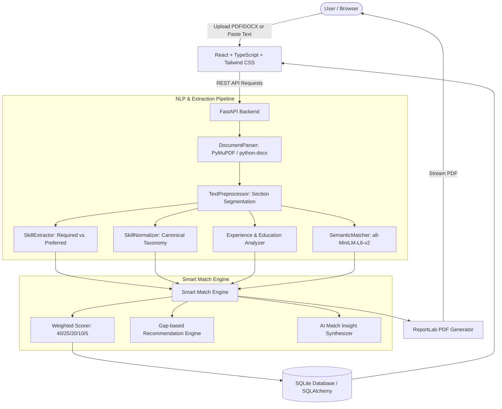

# Matchly AI – Intelligent Resume & Job Description Matching System

<div align="center">


**A production-quality full-stack NLP system that computes explainable, multi-tiered compatibility between candidate resumes and job postings.**

</div>

---

## 1. Problem Statement

Conventional Applicant Tracking Systems (ATS) rely on rigid keyword counting. This leads to two critical failures:
1. **False Negatives:** Highly qualified candidates are rejected simply because their resume phrases concepts differently (e.g., using "predictive modeling with Scikit-learn" instead of the exact phrase "Machine Learning", or "AWS" instead of "Amazon Web Services").
2. **Black-box Rejection:** Applicants receive arbitrary rejection notices without transparent feedback or actionable suggestions on how to close actual skill gaps.

## 2. Objectives

- Parse actual uploaded documents in **PDF** and **DOCX** formats up to 15 MB.
- Eliminate arbitrary or simulated match percentages; every calculation is grounded in transparent NLP algorithms.
- Classify skills into three distinct tiers: **MATCHED**, **PARTIAL / SEMANTIC**, and **MISSING**.
- Perform contextual vector comparisons using **Sentence Transformers (`all-MiniLM-L6-v2`)**.
- Verify work experience tenure and degree qualifications without fabricating information.
- Synthesize actionable, gap-based resume improvement recommendations.
- Provide a modern **"AI Match Radar"** dashboard with Recharts visualizations, history tracking, and downloadable PDF reports.

---

## 3. System Architecture



---

## 4. Smart Match Engine: Scoring Formula & Weights

Matchly AI calculates an explainable composite compatibility score out of 100 based on five configurable parameters configured in `backend/app/config.py`:

$$\text{Final Match Score} = (W_{req} \times S_{req}) + (W_{sem} \times S_{sem}) + (W_{exp} \times S_{exp}) + (W_{pref} \times S_{pref}) + (W_{edu} \times S_{edu})$$

| Metric Component | Default Weight | Scoring Method |
| :--- | :---: | :--- |
| **Required Skill Match ($S_{req}$)** | **40%** | Exact matches receive 100% credit; partial semantic matches receive 50% credit. |
| **Semantic Text Similarity ($S_{sem}$)** | **25%** | Dense embedding cosine similarity comparing Resume Experience vs. JD Responsibilities and Resume Summary vs. JD Overview. |
| **Experience Match ($S_{exp}$)** | **20%** | Comparison of detected tenure against target years. Scaled proportionally if below requirement; returns transparent "undetermined" if not verifiable. |
| **Preferred Skill Match ($S_{pref}$)** | **10%** | Bonus technologies and secondary qualifications. Default 100% if no preferred skills mandated. |
| **Education Match ($S_{edu}$)** | **5%** | Verification of degree level (Doctorate, Masters, Bachelors, Associate) and relevant technical field. |

### Match Index Bands
- **80% - 100%**: **Strong Match** (Emerald Green)
- **60% - 79%**: **Good Match** (Electric Blue)
- **40% - 59%**: **Moderate Match** (Amber / Orange)
- **0% - 39%**: **Low Match** (Red)

---

## 5. Technology Stack

### Backend
- **Python 3.12+**
- **FastAPI**: Asynchronous high-performance REST API.
- **Sentence Transformers (`all-MiniLM-L6-v2`)**: Pre-trained dense vector sentence embeddings.
- **spaCy (`en_core_web_sm`) & NLTK**: Natural language processing, tokenization, and linguistic parsing.
- **scikit-learn**: Cosine similarity calculations and matrix operations.
- **PyMuPDF (`fitz`)**: Fast PDF document parsing.
- **python-docx**: DOCX document and table text extraction.
- **ReportLab**: Executive PDF report generation.
- **SQLAlchemy & SQLite**: Database persistence for analyses and history.

### Frontend
- **React 19 & TypeScript**: Component-based user interface.
- **Vite**: Ultra-fast build tool and dev server.
- **Tailwind CSS 4**: Modern AI Match Radar styling.
- **Recharts**: Interactive horizontal bar charts and skill compatibility donut charts.
- **Lucide React**: Clean SaaS icon library.

---

## 6. Project Structure

```
resume-job-matcher/
├── backend/
│   ├── app/
│   │   ├── api/
│   │   │   ├── resume_routes.py      # Resume upload and parsing
│   │   │   ├── job_routes.py         # Job description ingestion
│   │   │   ├── match_routes.py       # Core match execution & PDF report
│   │   │   └── history_routes.py     # Past analysis management
│   │   ├── models/
│   │   │   └── entities.py           # SQLAlchemy entities (Analysis, Resume, JD)
│   │   ├── schemas/
│   │   │   └── match.py              # Pydantic request/response schemas
│   │   ├── services/
│   │   │   ├── document_parser.py    # PyMuPDF & python-docx parser
│   │   │   ├── text_preprocessor.py  # Cleaning & section segmentation
│   │   │   ├── skill_normalizer.py   # Multi-token alias normalization
│   │   │   ├── skill_extractor.py    # Required vs. preferred classification
│   │   │   ├── semantic_matcher.py   # all-MiniLM-L6-v2 embedding similarity
│   │   │   ├── experience_analyzer.py# Tenure interval & statement extraction
│   │   │   ├── education_analyzer.py # Degree & field verification
│   │   │   ├── scoring_engine.py     # Smart Match Engine orchestrator
│   │   │   ├── recommendation_engine.py # Gap-based improvement generator
│   │   │   └── report_generator.py   # ReportLab PDF report builder
│   │   ├── config.py                 # Centralized settings & weights
│   │   ├── database.py               # Database engine & session setup
│   │   └── main.py                   # FastAPI application entrypoint
│   ├── data/
│   │   └── skills.json               # Canonical skill taxonomy (14 categories)
│   ├── tests/
│   │   └── test_smart_match_pipeline.py # Comprehensive pytest test suite
│   ├── Dockerfile
│   └── requirements.txt
├── frontend/
│   ├── src/
│   │   ├── components/
│   │   │   ├── Navbar.tsx            # Navigation bar & brand
│   │   │   ├── ScoreGauge.tsx        # Large circular SVG match index gauge
│   │   │   ├── ScoreCard.tsx         # Metric cards (Required, Semantic, etc.)
│   │   │   ├── SkillBadgeGroup.tsx   # Matched, Partial, and Missing badges
│   │   │   ├── SkillCharts.tsx       # Recharts Bar & Donut charts
│   │   │   ├── AIInsightCard.tsx     # Dynamic narrative insight card
│   │   │   ├── RecommendationsList.tsx # Actionable numbered advice cards
│   │   │   ├── MatchBreakdownFlow.tsx# Visual stage-by-stage flowchart
│   │   │   ├── AnalysisProgressModal.tsx # Live pipeline stage animator
│   │   │   └── Dropzone.tsx          # Drag-and-drop file uploader
│   │   ├── pages/
│   │   │   ├── DashboardPage.tsx     # Hero & 1-click test scenarios
│   │   │   ├── AnalyzePage.tsx       # Resume & JD input workflow
│   │   │   ├── ResultsPage.tsx       # AI Match Radar results dashboard
│   │   │   ├── HistoryPage.tsx       # Saved analyses & delete options
│   │   │   ├── HowItWorksPage.tsx    # Technical formula documentation
│   │   │   └── AboutPage.tsx         # Tech stack & security overview
│   │   ├── services/
│   │   │   └── api.ts                # API client
│   │   ├── types/
│   │   │   └── index.ts              # TypeScript schemas
│   │   ├── App.tsx
│   │   └── index.css
│   ├── Dockerfile
│   ├── nginx.conf
│   └── package.json
├── sample_data/
│   ├── jds/                          # 4 Realistic Job Descriptions
│   │   ├── ml_engineer_jd.txt
│   │   ├── backend_developer_jd.txt
│   │   ├── data_scientist_jd.txt
│   │   └── frontend_developer_jd.txt
│   └── resumes/                      # 5 Distinct Resumes (PDF & DOCX)
│       ├── resume_1_senior_ml_engineer.pdf
│       ├── resume_2_junior_python_dev.pdf
│       ├── resume_3_frontend_react_dev.docx
│       ├── resume_4_data_analyst.pdf
│       └── resume_5_devops_cloud_engineer.pdf
├── docs/
│   ├── architecture.md
│   └── scoring_formula.md
├── docker-compose.yml
├── .env.example
└── README.md
```

---

## 7. Installation & Setup

### Prerequisites
- **Python 3.12+**
- **Node.js 20+** and **npm**
- *(Optional)* **Docker & Docker Compose**

### Local Environment Setup

#### 1. Backend Setup
```bash
cd backend
python -m pip install -r requirements.txt
```

#### 2. Frontend Setup
```bash
cd frontend
npm install
```

---

## 8. Running the Application

### Option A: Running Locally (Development Mode)

**Terminal 1: Start FastAPI Backend Server**
```bash
cd backend
uvicorn app.main:app --host 127.0.0.1 --port 8000 --reload
```
*The backend API documentation will be accessible at `http://127.0.0.1:8000/docs`.*

**Terminal 2: Start Vite Frontend Development Server**
```bash
cd frontend
npm run dev
```
*Access the Matchly AI Dashboard in your browser at `http://localhost:5173`.*

---

### Option B: Running with Docker Compose

To start both the frontend and backend in isolated production containers:

```bash
docker-compose up --build
```
- Frontend Web App: `http://localhost:3000`
- Backend REST API: `http://localhost:8000/docs`

---

## 9. Automated Testing

Run the automated pytest test suite covering parsers, normalizers, embeddings, scoring differentiation, and PDF generation:

```bash
python -m pytest backend/tests -v
```

All 12 unit and integration tests validate the complete end-to-end pipeline.

---

## 10. API Documentation

| Method | Endpoint | Description |
| :--- | :--- | :--- |
| `GET` | `/api/health` | Health status and current engine weights. |
| `POST` | `/api/resume/upload` | Uploads and extracts text from resume (`.pdf`, `.docx`). |
| `POST` | `/api/job-description/upload` | Ingests JD text or document file. |
| `POST` | `/api/match/analyze` | Executes Smart Match Engine on JSON payload. |
| `POST` | `/api/match/analyze-files` | Multipart upload and direct match execution. |
| `GET` | `/api/match/{id}` | Retrieves a saved match analysis. |
| `GET` | `/api/match/{id}/pdf` | Downloads generated executive PDF report. |
| `GET` | `/api/history` | Lists all historical matches. |
| `DELETE` | `/api/history/{id}` | Deletes an analysis record. |

---

## 11. Sample Input & Output

### Input: Machine Learning Engineer JD vs. Senior ML Resume

```json
{
  "overall_score": 88,
  "match_level": "Strong Match",
  "scores": {
    "required_skills": 100.0,
    "semantic_similarity": 82.5,
    "experience": 100.0,
    "preferred_skills": 66.7,
    "education": 100.0
  },
  "matched_skills": [
    { "name": "Python", "category": "Programming", "match_type": "exact", "importance": "required" },
    { "name": "Scikit-learn", "category": "Machine Learning", "match_type": "exact", "importance": "required" },
    { "name": "PyTorch", "category": "Deep Learning", "match_type": "exact", "importance": "required" },
    { "name": "Docker", "category": "DevOps", "match_type": "exact", "importance": "required" },
    { "name": "SQL", "category": "Database", "match_type": "exact", "importance": "required" },
    { "name": "AWS", "category": "Cloud", "match_type": "exact", "importance": "preferred" }
  ],
  "partial_skills": [
    { "name": "Transformers", "category": "Deep Learning", "similarity": 0.68, "related_resume_skill": "fine-tuned BERT pipelines" }
  ],
  "missing_skills": [
    { "name": "Kubernetes", "category": "DevOps", "importance": "preferred", "reason": "Preferred skill in JD with no corresponding competencies in resume." }
  ],
  "experience": {
    "required": 3.0,
    "detected": 4.0,
    "status": "meets_requirement",
    "details": "Resume demonstrates ~4.0 years of experience, meeting the required 3.0 years."
  },
  "education": {
    "status": "satisfied",
    "detected_degrees": ["Bachelor of Science in Computer Science"],
    "details": "Candidate education satisfies the requirement for Bachelor's degree."
  },
  "insight": "You are a strong match (88%) for this position. Your profile strongly aligns with the core requirements, displaying robust proficiency in Python, Scikit-learn, PyTorch, and Docker. Your ~4.0 years of background satisfies the targeted experience benchmark.",
  "recommendations": [
    {
      "id": 1,
      "title": "Highlight Cloud & Deployment Infrastructure",
      "type": "skill_gap",
      "description": "The employer prioritizes infrastructure competencies like Kubernetes, which are missing from your profile.",
      "action": "Consider detailing specific container orchestration setups or CI/CD pipelines you have built or configured in your previous positions or side projects."
    }
  ]
}
```

---

## 12. Future Enhancements

- Support for multi-lingual resume matching (Spanish, German, French).
- Automatic PDF resume generation with gap-filling suggestions highlighted.
- Integration with external ATS APIs (Greenhouse, Lever, Workday).
- Interactive interview question generator based on candidate's missing or partial skills.
